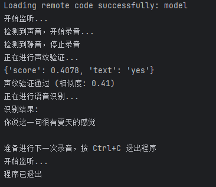

# SenseVoice-Real-Time

本项目就是一个小的学习项目，实现了一下最简单的语音端点检测VAD（没用模型实现，这点确实该优化一下）、利用SenseVoice实现语音转录、利用CAM++实现说话人确认（声纹锁），实现并不复杂，简单玩玩，没什么实力，如果你找到了我这那纯属我们的缘分哈哈。


PS：下面这部分是旧版本的使用说明了，当然了也是能跑起来的，想看最新的可以拉到最底下去看新版使用说明。


## 运行步骤

1. **下个CUDA版本的torch，版本号<=2.3就行（但是可能会下的比较慢）**

   ```
   pip install torch==2.2.1+cu118 torchaudio==2.2.1+cu118 --index-url https://download.pytorch.org/whl/cu118
   ```

2. **安装requirements.txt中的依赖**

   ```
   pip install -r requirements.txt -i http://mirrors.aliyun.com/pypi/simple -i https://pypi.tuna.tsinghua.edu.cn/simple some-package
   ```

3. **前往`modelscope`下载`SenseVoiceSmall`**

   链接：https://www.modelscope.cn/models/iic/SenseVoiceSmall/files

   或者直接通过 git lfs下载

   ```
   git clone https://www.modelscope.cn/iic/SenseVoiceSmall.git
   ```

   下载完成后放入根目录下的`SenseVoiceSmall`文件夹中即可

4. **前往`modelscope`下载`iic/speech_campplus_sv_zh_en_16k-common_advanced`**
   链接：https://www.modelscope.cn/models/iic/speech_campplus_sv_zh_en_16k-common_advanced/files
   或者直接通过 git lfs下载

   ```
   git clone https://www.modelscope.cn/iic/speech_campplus_sv_zh_en_16k-common_advanced.git
   ```

   下载后放入根目录下的`speech_campplus_sv_zh_en_16k-common_advanced`文件夹即可

5. **自行录音，手机随便录一段，并通过脚本转换采样率**

   首先将音频放入speakers文件夹中
   项目中提供了脚本`audio_convert.py`，将音频转换为WAV格式并把采样率转换为16K，因为`speech_campplus`模型只能处理16K的音频。
   如果你的音频名字有修改，记得去`demo_record_natural_voice_lock.py`中也把文件名改一下

   ```Python
   def main():
       # 创建保存目录（如果目录不存在）
       save_directory = "audio_logs"
       os.makedirs(save_directory, exist_ok=True)
       # 加载声纹锁示例音频，如果你的音频名字修改了则这里也需要修改
       reference_audio = "speakers/speaker_mine_converted.wav"
   ```

6. 运行`demo_record_natural_voice_lock.py`

   ```
   python demo_record_natural_voice_lock.py
   ```


## 运行示例




如果你觉得运行效果不太行，可以修改一下参数，在`demo_record_natural_voice_lock.py`中

```Python
# 音频参数
CHUNK = 1024
FORMAT = pyaudio.paInt16
CHANNELS = 1
RATE = 16000
MAX_TIME = 60  # 最大录音时间（秒）

# VAD 参数
THRESHOLD = 500
SILENCE_LIMIT = 2

# 声纹识别参数
SIMILARITY_THRESHOLD = 0.1  # 相似度阈值，可以根据需要调整
```


另外我觉得SenseVoice转录错字率有点太高了，不过能识别粤语挺不错的占用显存也少，你也可以在本项目基础上改用其他模型来玩玩。


# 2024.09.23更新

也是更新上了，这次更新是大更，原本SenseVoice的错字率有点太高了，这次换了另一个模型，不过使用很简单。

先说说现在能实现的效果：使用VAD模型进行端点检测、较高的识别准确率、较低的显存占用、语音识别后添加标点（不过没做声纹锁哦这次，想要加也很简单的）


首先如果你之前clone过我的项目，那么请更新一下拉取最新的文件。


接着再次pip install一下，因为更新了几个依赖

```
pip install -r requirements.txt -i http://mirrors.aliyun.com/pypi/simple -i https://pypi.tuna.tsinghua.edu.cn/simple some-package
```


**然后分别下载这几个模型：**

1.`speech_seaco_paraformer_large_asr_nat-zh-cn-16k-common-vocab8404-pytorch`

```
git clone https://www.modelscope.cn/iic/speech_seaco_paraformer_large_asr_nat-zh-cn-16k-common-vocab8404-pytorch.git
```

2.`speech_fsmn_vad_zh-cn-16k-common-pytorch`

```
git clone https://www.modelscope.cn/iic/speech_fsmn_vad_zh-cn-16k-common-pytorch.git
```

3.`punc_ct-transformer_zh-cn-common-vocab272727-pytorch`

```
git clone https://www.modelscope.cn/iic/punc_ct-transformer_zh-cn-common-vocab272727-pytorch.git
```

PS：新版我没搞说话人确认，但是很简单，你可以去看看`speech_campplus_sv_zh-cn_16k-common`模型的官方的文档，把模型加进来还有按照我旧版的说明转换一下16K音频提供给模型即可。

然后把模型都放到根目录下的models文件夹里，各自起个文件夹对应，反正你能搞明白路径就行。

```py
asr_model = AutoModel(model="./models/speech_seaco_paraformer_large_asr_nat-zh-cn-16k-common-vocab8404-pytorch",
                      model_revision="v2.0.4",
                      vad_model="./models/speech_fsmn_vad_zh-cn-16k-common-pytorch",
                      vad_model_revision="v2.0.4",
                      punc_model="./models/punc_ct-transformer_zh-cn-common-vocab272727-pytorch",
                      punc_model_revision="v2.0.4",
                      # 想搞说话人确认的在这加进来
                      # spk_model="./models/speech_campplus_sv_zh-cn_16k-common",
                      # spk_model_revision="v2.0.2",
                      device="cuda:0")
```


确保已经有了这俩文件夹，其中silero_vad才是我们真正用来进行端点检测的模型。

```py
vad_model_path = './models/vad_onnx/silero_vad.onnx'  # VAD onnx模型路径
audio_save_path = './audio_logs'  # 保存临时音频文件的路径
```

那为什么后面AutoModel还要加一个VAD模型呢？因为这里不加VAD的话PUNC就不生效，我也懒得再分开了，感觉也不吃性能。

觉得膈应的可以把AutoModel里的VAD去掉，然后把PUNC单独拆开，代码里有详细说明。


调整参数以获取更好的结果：

```py
max_files = 10  # 最多保留的临时音频数量
window_size = 512  # 语音窗口大小
min_silence_duration = 1.5  # 最小静音持续时间(s)
min_speech_duration = 0.05  # 最小语音持续时间(s)
segment_count = 0  # 用于生成音频文件的命名
```


最后运行`demo_vad_voice_translate_async.py`

本项目中使用了多线程进行在上一次识别的时候还能进行下一次的录音，让实时更实时。

有问题提Issue。